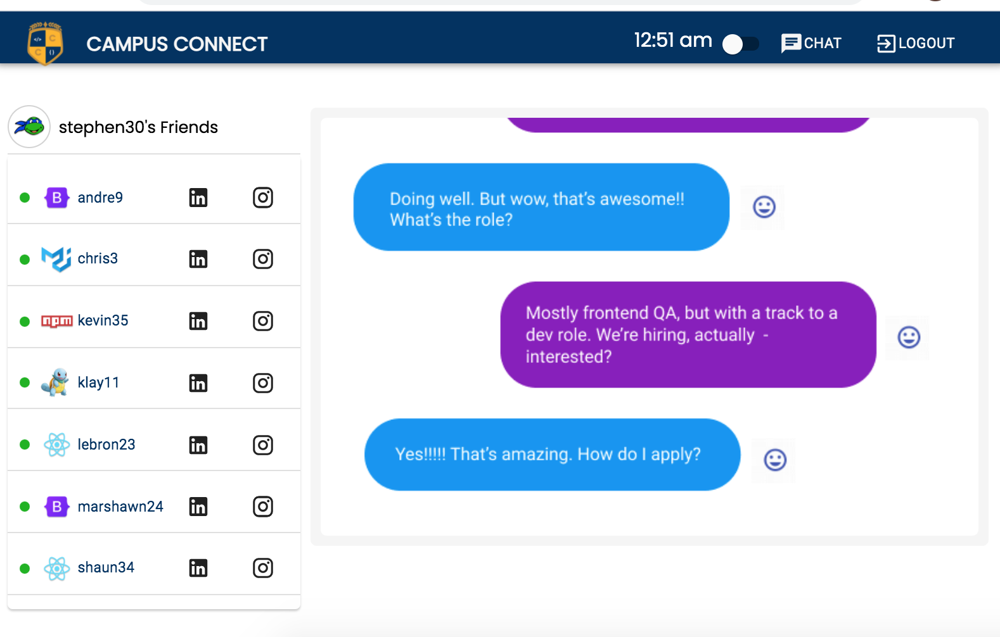

## Description
This is an app to connect Coding Bootcamp Alumni for networking purposes. Find a friend, a reference, talk tech stacks or chat about the good ol' bootcamp days. Celebrate, we made it!

Our motivation was not only to test the limits of our skillset by using React, Graphql and a Apollo websocket link. We were also driven by a passionate desire to provide a lasting connection for our cohort.

We wanted to create a chat application made specifically for Coding Bootcamp alums with both professional & personal networking and some fun features. The team leveraged the skills developed in bootcamp to create a way to connect the people with whom those skills were built. The Campus Connect Development Team hope this app will be used to stay in touch, support each other in our job searches, and facilitate tech career progression!

The application is deployed on [https://campus-connect21.herokuapp.com/](https://campus-connect21.herokuapp.com/)
You can also view the [Campus Connect Github Repository](https://github.com/Clayto30/campus-connect)

## Built Using 
- [x] JavaScript
- [x] ES6
- [x] MongoDB
- [x] React
- [x] Bootstrap
- [x] Node.js (Express, Mongoose, graphQL, jsonwebtoken, Apollo/Client, Apollo-Server-Express)

## Table of Contents
* [Installation](#Installation)
* [Usage](#Usage)
* [User-Story](#User-Story)
* [Acceptance-Criteria](#Acceptance-Criteria)
* [License](#License)
* [Contributing](#Contributing)
* [Tests](#Tests)
* [Questions](#Questions)

### Installation
To clone the repo run ```git clone https://github.com/Clayto30/campus-connect.git ``` in your terminal      
Run ```npm install``` to install the necessary dependencies.

### Usage
After installing all the dependencies, run ```npm start``` in your terminal to start the application. 

Whether you are running the project locally, or using the deployed application, you can start by filling in your email address, choosing a unique user name and selecting a password. Don't forget that password, just like you won't forget this cohort and experience in BootCamp!

This will take you to the onboarding page where you can personalize your experience by selecting some logos and entering your social media handles to help others find you and stay connected.

Following this, you can get to chatting! Connect with the other users of Campus Connect! When you are chatting, be sure to share your successes, opportunities, questions, quandaries, memories, enouragement and updates! 



When you are feeling like you are in a great mood, go ahead and give the them switcher toggle a try. Party time!


### User-Story 
> AS AN UCB Coding Bootcamp Graduate       
> I WANT to keep in touch with my cohort and TAs       
> SO THAT I can maintain professional and personal relationships       

### Acceptance-Criteria

> GIVEN an application with a React front end     
> WHEN I review technologies used     
> THEN I see GraphQL with a Node.js and Express.js server are used     
> AND MongoDB and the Mongoose ODM are used for the database     
> AND queries and mutations for retrieving, adding, updating, and deleting data are incorporated     
> WHEN I see the application          
> THEN I see it is deployed on a Heroku link with data     
> WHEN I see the application's polished UI     
> THEN I see it is responsive and interative     
> WHEN I review the application code for authentication     
> THEN I see JWT has been used     
> WHEN sensitive API KEY Information is stored     
> THEN I can verify it is protected from public view
> WHEN I review the repository     
> THEN I see meets quality coding standards for file structure, naming conventions and descriptive comments     
> WHEN I review the README     
> THEN I see the repository has a unique name, description, technologies used, screenshot, and link to deployed application     


 
### License
This application is covered under **MIT** license.
[](https://opensource.org/licenses/MIT)


### Contributing 
- [Clayton Goff](https://github.com/Clayto30)         
- [Janarthani V S](https://github.com/vsjanarthani)         
- [Megan Close](https://github.com/MeganClo)         
- [Graham Hall](https://github.com/ghall89)         
- [Sarah Durkin](https://github.com/sarahdurks)         

### Questions
If you have any questions, please reach out to any of the contributors.

### Tests

We included several tests using Jest. Please be sure to run those test suites to demonstrate the way we incorporated test driven development strategies into our process.

This app is a progressive web application. So take it with you on the go, even if you're on a scenic hike and might lose wifi signal. Or, if you don't have the time, you can run this test using Chrome Web Dev tools to simulate the loss of connection you would experience on a scenic hike.

The responsive design is best demonstrated on our Chat page. On a small screen, the friend list becomes a drawer that slides out for your use on click. Be sure to check out this exciting feature to demonstrate our mobile-first responsive design.

### Resources 
[Confetti Animation](https://www.cssscript.com/demo/confetti-falling-animation/)


